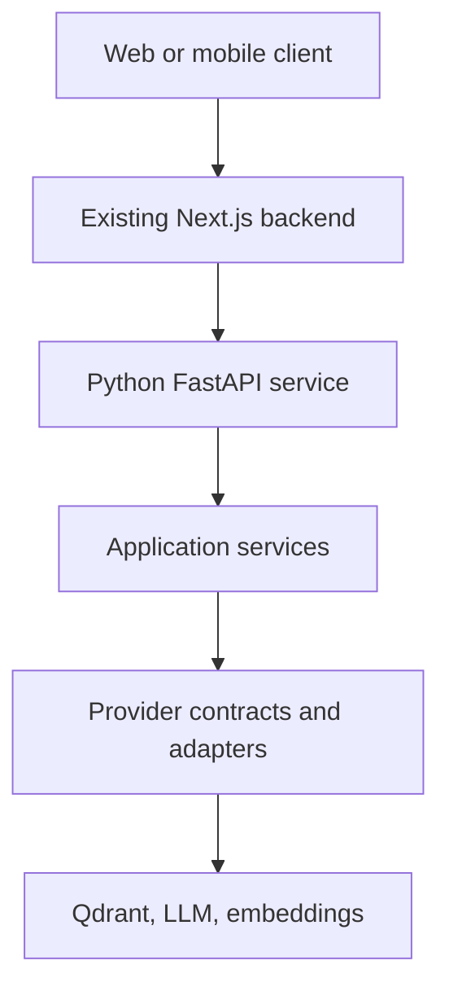
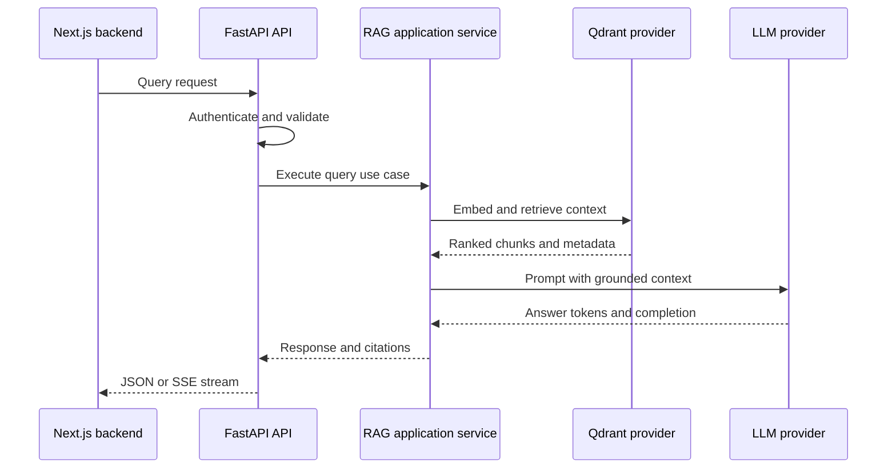
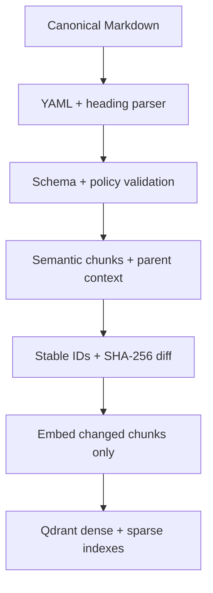
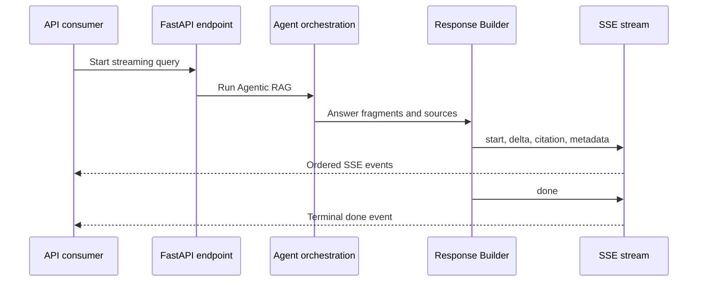
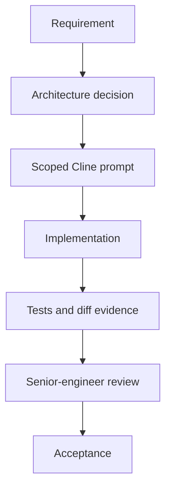
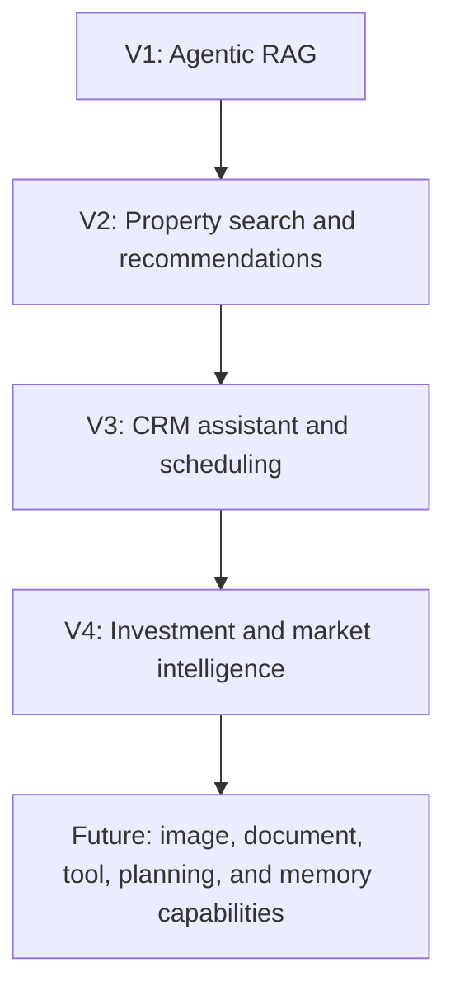

# Enterprise AI Platform for Real Estate

Python AI microservice for a worldwide real-estate platform.

This repository contains the AI service consumed by an existing Next.js backend. It is not the web application, mobile application, or the Next.js backend itself. The first capability is production-grade Agentic Retrieval-Augmented Generation (RAG), implemented as the foundation of a broader enterprise AI platform.

The platform is being built for long-term maintainability, provider independence, grounded answers, citations, streaming, and controlled extension into future AI capabilities.

## Project status

| Area | Status |
| --- | --- |
| Architecture and governance | Accepted |
| V1 capability | Agentic RAG foundation |
| Vector database | Qdrant only |
| Development LLM | Local Qwen 3.6 through LM Studio |
| Production LLM | AWS Bedrock models |
| Production embeddings | AWS Bedrock embedding models |
| Requirements alignment | In progress — 110-module Nofeez knowledge system |
| Implementation authorization | FND-001 complete; FND-002 is the only authorized task |
| Production readiness | Not yet reached |

The accepted architecture is ahead of the current implementation. Work is intentionally delivered as small, reviewable tasks rather than as a project-wide rewrite.

## What this service does

Version 1 is designed to provide:

- canonical Markdown knowledge ingestion for the 110 approved Nofeez modules;
- YAML metadata parsing, document validation, semantic heading-aware chunking, stable identity, hashing and version preservation;
- controlled PDF/project-document extraction as a separately classified source path;
- embedding generation;
- Qdrant vector persistence and retrieval;
- grounded answer generation;
- source citations;
- streaming responses;
- session-scoped conversation context;
- provider abstraction and configuration-driven composition;
- FastAPI delivery APIs; and
- LangGraph orchestration for Agentic RAG workflows.

The platform is not intended to be a simple chatbot or a framework demonstration. It is an extensible AI service whose first capability is RAG.

## Authoritative Nofeez knowledge model

V1 is a knowledge and orchestration layer, not a chatbot over files:

- RAG explains stable Nofeez product and business semantics.
- Live domain APIs provide current property, inventory, price, payment, compliance and user state.
- Model services provide estimates and predictions.
- Transaction tools perform authorized state changes.
- Permission filters determine what the current caller may retrieve before context reaches the LLM.
- Events, incremental indexing and reconciliation keep derived indexes synchronized with canonical sources.

The 110 approved Markdown modules are canonical sources. They are read, validated, versioned, indexed and archived; ingestion must never silently rewrite them.

## Service boundary

### Owned by this repository

- AI application services and use cases;
- ingestion and retrieval workflows;
- prompt construction;
- provider contracts and adapters;
- Qdrant integration;
- session and conversation context;
- response and citation formatting;
- FastAPI API delivery;
- LangGraph orchestration;
- evaluation foundations; and
- logging, metrics, health, and observability foundations.

### Outside this repository

- the existing Next.js backend;
- the existing web application;
- the existing mobile application;
- user-facing product workflows;
- real-estate business-system ownership; and
- production infrastructure decisions that are explicitly deferred in the ADRs.

The Next.js backend calls this service through its REST and streaming APIs. Changes to the Next.js backend are outside this project scope.

## Architecture at a glance

The service follows Clean Architecture, dependency inversion, provider abstraction, and single-responsibility boundaries.



The main ownership rules are:

- Controllers remain thin.
- Application services orchestrate use cases.
- Providers communicate with external systems.
- Repositories own persistence.
- Prompt Builder owns prompt construction.
- Retriever owns retrieval and ranking.
- Session Manager owns conversation context.
- Response Builder owns response and citation formatting.
- Tool Registry owns tool registration.
- LangGraph owns agent orchestration.
- Business logic remains provider-agnostic.
- External SDKs are not instantiated inside business logic.
- Circular dependencies are prohibited.

See [ARCHITECTURE.md](docs/ARCHITECTURE.md) for the complete specification.

## Runtime request flow

The target query lifecycle is validation, retrieval, prompt construction, generation, citation assembly, and streaming back to the caller.



## Document ingestion flow

Documents are converted into stable, traceable chunks before being written to Qdrant.



Ingestion must preserve document identity, chunk identity, source metadata, embedding compatibility, and enough information to produce reliable citations.

## Streaming flow

The approved V1 streaming protocol is Server-Sent Events (SSE).



Supported event categories are start, delta, citation, metadata, error, and done. A stream must end with an explicit done event. Errors after the stream starts are represented as SSE error events.

## Provider strategy

Provider choices are configuration-driven and selected during application composition. Exactly one implementation is active for each capability at runtime.

| Capability | Development | Production | Architecture rule |
| --- | --- | --- | --- |
| LLM | Local Qwen 3.6 through LM Studio's OpenAI-compatible endpoint | AWS Bedrock models | Application code depends on the LLM contract, not a vendor SDK |
| Embeddings | Current development configuration | AWS Bedrock embedding models | Embedding dimensions and index compatibility are explicit |
| Vector database | Qdrant | Qdrant | Qdrant is the only approved V1 vector database |
| Orchestration | LangGraph | LangGraph | LangGraph owns orchestration only |

The local development topology is a Mac running VS Code/Cline connected to a PC running LM Studio and the local Qwen model. The endpoint, port, host, and model identifier are configuration values; they must not be hard-coded in application source.

### Provider neutrality

The architecture uses provider-neutral contracts for LLMs, embeddings, vector stores, and other external capabilities. AWS Bedrock and LM Studio are the currently approved production and development choices respectively; they are not business-logic dependencies.

Future providers may be added through new adapters and composition configuration without moving business logic between layers.

## Technology stack

### Programming language

- CPython 3.14.7 only

### API framework

- FastAPI
- Pydantic and Pydantic Settings

### Agent framework

- LangGraph for orchestration only

### Vector database

- Qdrant in development and production

### Document processing

- PDF and document loaders selected by the ingestion layer
- Chunking and metadata normalization owned by application components

### Deployment

Production deployment topology is intentionally deferred until the required platform inputs are available. See [ADR-011](docs/ADR/ADR-011-deployment-runtime-topology-deferred.md).

### Development tooling

- VS Code and Cline on the Mac
- Local Qwen 3.6 served by LM Studio on the PC
- Git and GitHub
- Qdrant Cloud for the current development environment; self-hosted Qdrant
  remains a supported production deployment option

Development tooling is not a production runtime dependency.

## Repository layout

The implementation is being moved toward the following ownership model:

```
python-rag/
├── app/
│   ├── api/              # FastAPI routes and HTTP boundary
│   ├── application/     # Use cases and application services
│   ├── contracts/        # Provider and service interfaces
│   ├── domain/           # Platform and capability models
│   ├── ingestion/        # Loading, chunking, and ingestion workflow
│   ├── retrieval/        # Retrieval, filtering, and ranking
│   ├── prompts/          # Prompt Builder and prompt templates
│   ├── sessions/         # Session-scoped conversation context
│   ├── responses/        # Response and citation formatting
│   ├── agents/           # LangGraph orchestration
│   ├── providers/        # External-system adapters
│   ├── repositories/     # Persistence abstractions and implementations
│   ├── config/           # Typed settings and startup validation
│   ├── observability/    # Logging, metrics, tracing, and health
│   └── main.py           # Service composition and application entry point
├── tests/                # Unit, contract, integration, API, and evaluation tests
├── scripts/              # Explicit operational/development scripts
├── data/                 # Local development data only; never production secrets
├── docs/                 # Architecture, standards, ADRs, and planning
├── requirements.txt
└── README.md
```

The live baseline may still contain older flat modules while the bounded hardening tasks are completed. The target layout is documented in [ARCHITECTURE.md](docs/ARCHITECTURE.md); individual tasks must not perform unrelated bulk moves.

## API surface

The service is moving toward versioned APIs under /v1. The current repository snapshot contains legacy unversioned routes while the API boundary is being hardened and normalized.

### Current baseline routes

| Method | Route | Purpose | Status |
| --- | --- | --- | --- |
| GET | / | Basic service response | Legacy baseline |
| GET | /health | Basic health response | Legacy baseline |
| POST | /query | Generate a grounded answer | Legacy baseline |
| POST | /retrieve | Retrieve context without generation | Legacy baseline |
| POST | /ingest | Ingest documents from a directory | Legacy baseline |
| GET | /sources | List ingested sources | Legacy baseline |
| GET | /sources/{doc_id} | Return source metadata | Legacy baseline |

These routes describe the audited baseline, not a final production contract. New API work must follow [API_GUIDELINES.md](docs/API_GUIDELINES.md), use the /v1 versioning strategy, and preserve provider-neutral error and streaming contracts.

### Query example for the current baseline

```bash
curl -X POST http://localhost:8000/query \
  -H "Content-Type: application/json" \
  -d '{
    "query": "What documents are needed to buy a property?",
    "top_k": 5
  }'
```

### Retrieve example for the current baseline

```bash
curl -X POST http://localhost:8000/retrieve \
  -H "Content-Type: application/json" \
  -d '{
    "query": "property registration process",
    "top_k": 3
  }'
```

## Development setup

### Prerequisites

- CPython 3.14.7 only;
- Git;
- a reachable Qdrant deployment: Qdrant Cloud or self-hosted Qdrant;
- LM Studio running on the development PC for local Qwen inference; and
- network access from the Mac development environment to the configured LM Studio endpoint.

AWS credentials and Bedrock access are required only for production-provider development or integration testing. Never commit credentials to this repository.

### Create a virtual environment

```bash
python3.14 -m venv .venv
source .venv/bin/activate
```

On Windows PowerShell:

```powershell
py -3.14 -m venv .venv
.venv\Scripts\Activate.ps1
```

### Install dependencies

```bash
python -m pip install --upgrade pip
pip install -r requirements-dev.txt
```

Use `requirements.txt` for runtime-only installations and `requirements-dev.txt` for local development, testing, linting, and type checking. The dependency files are part of the runtime-foundation hardening work. Legacy Chroma dependencies found in the audited baseline are outside the approved architecture and are removed through the scoped FND-005 task.

### Configure the service

Use the repository's environment/configuration mechanism for local values. Configuration must provide, as applicable:

- active LLM provider and model;
- LM Studio-compatible endpoint for local Qwen;
- active embedding provider and model;
- embedding dimension/index compatibility;
- Qdrant URL and, when required, API key;
- Qdrant collection name;
- retrieval and chunking limits;
- timeout and streaming settings; and
- logging and environment settings.

Do not copy production credentials into local files. Do not hard-code provider names, endpoints, LAN addresses, model IDs, or API keys in Python modules.

For Qdrant Cloud, the effective configuration is conceptually:

```dotenv
QDRANT_URL=https://your-cluster-url:6333
QDRANT_API_KEY=replace-me
QDRANT_COLLECTION_NAME=your-collection
```

Use the actual variable names defined by the typed settings module. Keep the API key in an ignored local environment file or approved secret manager; never commit it.

For a self-hosted Qdrant deployment, use the same client contract and configure
the self-hosted HTTPS or internal service URL. The API key may be omitted only
when the deployment is intentionally configured without API-key authentication.
The deployment decision belongs to infrastructure configuration, not to the
application or repository layer.

### Start the development service

```bash
uvicorn app.main:app --reload
```

The governance gate for FND-002 is accepted; FND-003 and later remain blocked.

### Run tests

```bash
pytest
```

The test strategy includes unit, contract, integration, API, end-to-end, and AI evaluation tests. See [TESTING.md](docs/TESTING.md).

## Data and indexing

Qdrant is used in both development and production to avoid vector-store drift. A collection is compatible with an embedding configuration only when its vector dimension, distance metric, model identity, preprocessing, and version metadata match the active index contract.

When an embedding configuration changes incompatibly, create a new collection/index version and migrate deliberately. Do not silently write vectors from a new embedding model into an existing incompatible collection.

Local development documents and indexes are disposable development data. Production data handling, retention, access control, and deployment topology are governed by the relevant security and deployment decisions.

## Grounding, citations, and evaluation

The service is expected to produce answers grounded in retrieved context and to expose enough source metadata for consumers to render citations.

Evaluation covers:

- groundedness;
- faithfulness to retrieved context;
- citation accuracy and completeness;
- retrieval relevance;
- hallucination rate;
- latency and time to first token;
- streaming correctness; and
- provider and index compatibility.

Quality thresholds are not invented before representative evaluation datasets and baselines exist. See [TESTING.md](docs/TESTING.md), [ARCHITECTURE.md](docs/ARCHITECTURE.md), and [OBSERVABILITY.md](docs/OBSERVABILITY.md).

## Security and reliability

The service must:

- validate configuration before accepting dependent traffic;
- keep secrets outside source control;
- enforce the Next.js-to-Python trust boundary once ADR-009 is finalized;
- return stable provider-neutral error envelopes;
- avoid leaking raw exception messages;
- use bounded timeouts and explicit cancellation;
- expose real liveness and readiness signals;
- emit structured logs with correlation context; and
- avoid global mutable request state.

Authentication/trust mechanism, telemetry vendor, and deployment topology are explicitly deferred decisions. See [SECURITY.md](docs/SECURITY.md), [ADR-009](docs/ADR/ADR-009-nextjs-python-authentication-trust-deferred.md), [ADR-010](docs/ADR/ADR-010-production-telemetry-stack-deferred.md), and [ADR-011](docs/ADR/ADR-011-deployment-runtime-topology-deferred.md).

## Engineering workflow

Implementation follows a controlled sequence:



Every implementation task must:

1. Have one logical objective.
2. Name the allowed files and prohibited scope.
3. Follow the accepted architecture and ADRs.
4. Include focused tests.
5. Return the actual diff and test evidence.
6. Stop and report blockers instead of broadening scope.
7. Wait for review acceptance before the next prompt is generated.

The controlled prompt registry is PROMPTS.md. The active backlog is TASKS.md.

Governance documents, task promotion, prompt authorization, and workspace rules are maintained by the project owner and principal architect. Cline is used only for implementation and test-code generation under an already approved prompt; it may read governance sources but must not edit them.

## Non-negotiable rules

The project must never:

- call an LLM, embedding, or Qdrant SDK directly from a FastAPI controller;
- put prompt construction inside a provider;
- put business logic inside a provider or controller;
- access Qdrant collection objects directly from API routes;
- bypass a provider or repository interface;
- hard-code a vendor assumption into application logic;
- use ChromaDB for V1;
- use globals for request or session state;
- expose raw exception text to API consumers;
- introduce circular dependencies; or
- redesign the architecture during an isolated implementation task;
- answer current property, inventory, price, payment, compliance or user-state questions from static RAG alone;
- expose restricted content to the LLM before permission filtering; or
- treat user conversations or unverified uploaded content as canonical knowledge.

## Roadmap



The current ordered roadmap is maintained in ROADMAP.md. Future capabilities begin only after the V1 foundation has passed implementation, evaluation, and production-readiness gates.

## Documentation map

### Core authority

- [Master Context](docs/MASTER_CONTEXT.md)
- [Project Vision](docs/PROJECT_VISION.md)
- [Architecture](docs/ARCHITECTURE.md)

### Architecture decisions

- [ADR directory](docs/ADR/)

### Engineering standards

- [Code Style](docs/CODE_STYLE.md)
- [Contributing](docs/CONTRIBUTING.md)
- [Testing](docs/TESTING.md)
- [Security](docs/SECURITY.md)
- [API Guidelines](docs/API_GUIDELINES.md)
- [Observability](docs/OBSERVABILITY.md)

### Planning and review

- [Roadmap](docs/ROADMAP.md)
- [Tasks](docs/TASKS.md)
- [Cline Prompt Registry](docs/PROMPTS.md)
- [Engineering Review](docs/REVIEW.md)

New engineers should read [MASTER_CONTEXT.md](docs/MASTER_CONTEXT.md), [PROJECT_VISION.md](docs/PROJECT_VISION.md), [ARCHITECTURE.md](docs/ARCHITECTURE.md), and the relevant ADRs before changing application code.

## Contributing

Contributions must preserve the service boundary, provider pattern, Qdrant-only V1 decision, streaming compatibility, and documented ownership rules.

Before opening a change:

```bash
git status
git diff
pytest
```

Documentation changes should update the relevant source-of-truth document or ADR. Implementation changes should identify the task ID and include tests and review evidence. See [CONTRIBUTING.md](docs/CONTRIBUTING.md).

## License

The project license and contribution terms will be added when finalized by the project owner.
