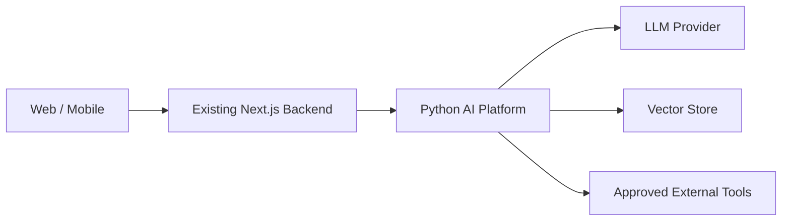
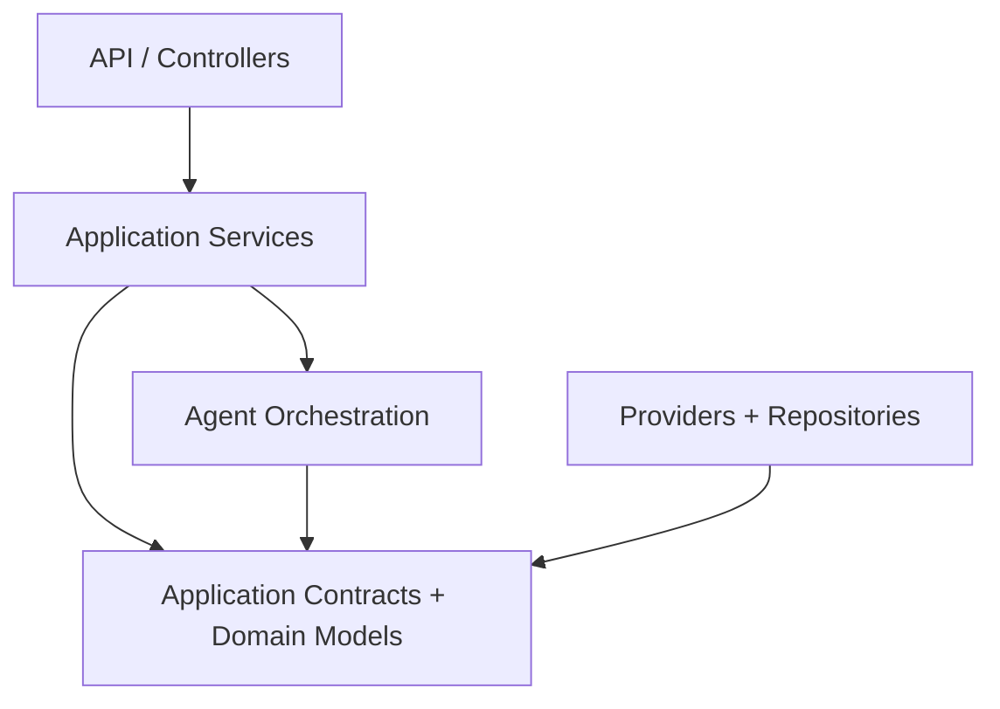
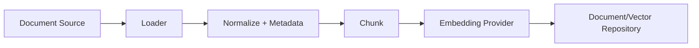
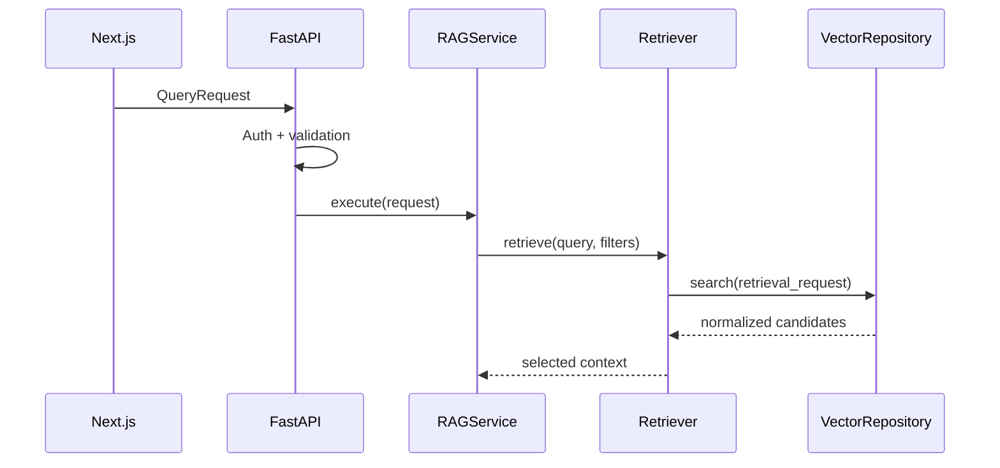
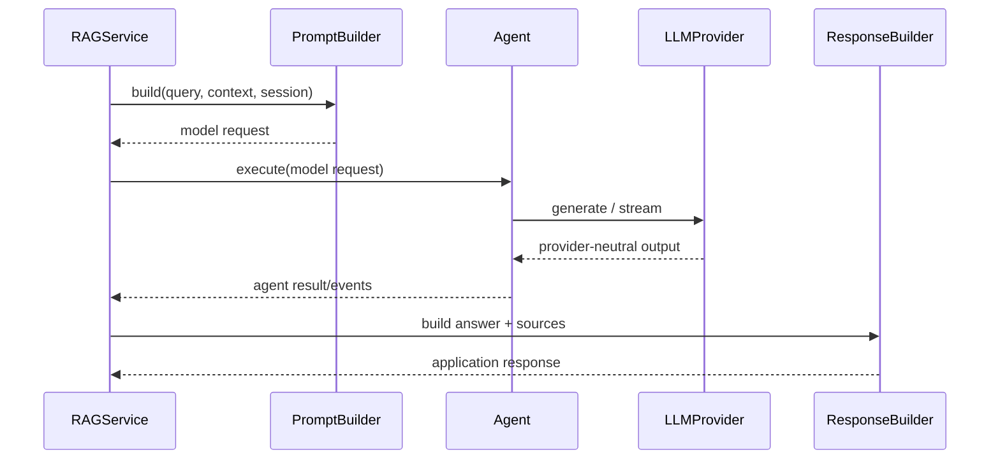
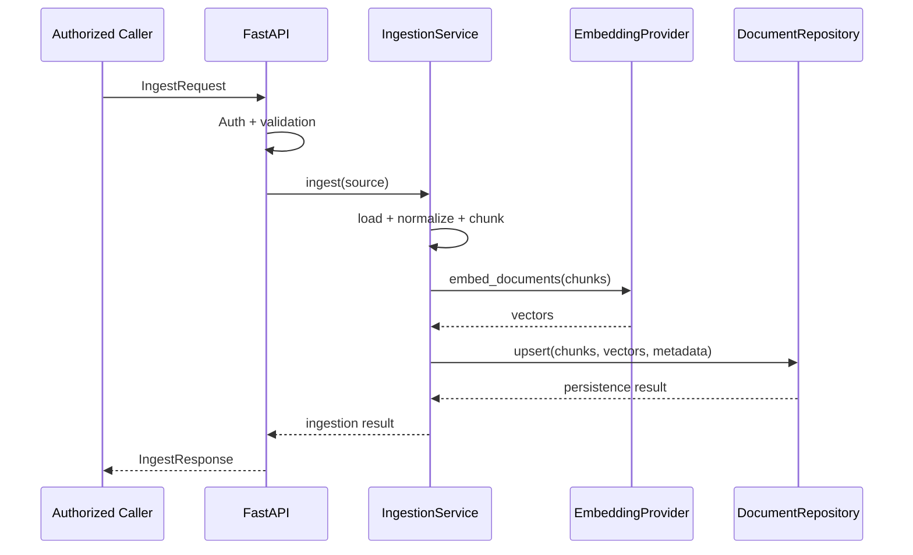
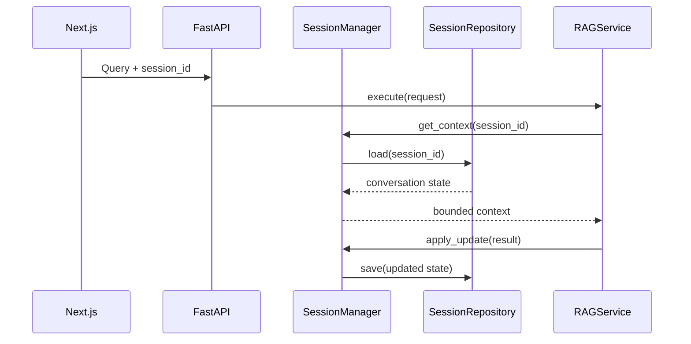
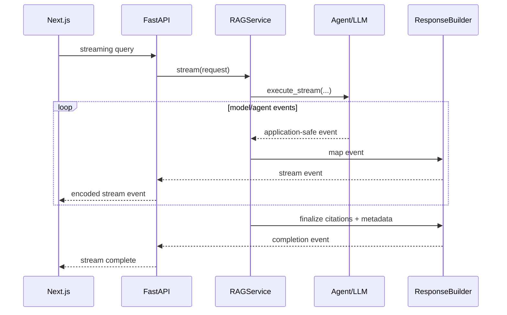
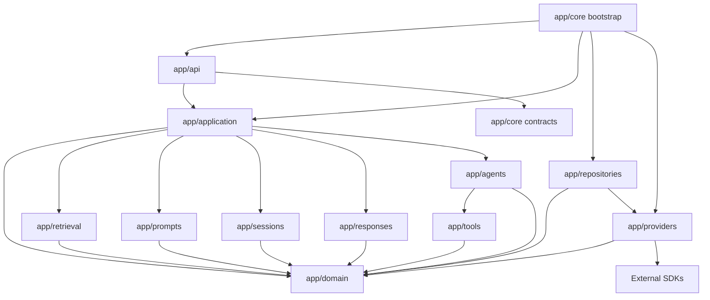

# Enterprise AI Platform for Real Estate — Architecture Specification

**Status:** ACCEPTED  
**Version:** 1.3  
**Last Updated:** 2026-08-07  
**Owner:** Dhanush Reddy  
**Primary Architecture Role:** Principal AI Architect  
**Initial Production Capability:** Agentic RAG

## 1. Purpose and Authority

This document defines the approved target architecture for the Python AI Platform that serves the existing worldwide real estate product.

It is written as an engineering specification, not as an implementation tutorial. A senior engineer joining the project should be able to use this document to understand system boundaries, dependency direction, module ownership, runtime flows, provider strategy, production expectations, extension points, and the difference between the current repository and the target architecture.

The authority order for engineering work is:

1. `MASTER_CONTEXT.md` — project mandate and role boundaries;
2. `PROJECT_VISION.md` — product and engineering north star;
3. `ARCHITECTURE.md` — approved structural and dependency rules;
4. accepted ADRs — decisions and exceptions for specific architectural questions;
5. engineering standards such as `CODE_STYLE.md`, `TESTING.md`, `SECURITY.md`, and `API_GUIDELINES.md`;
6. task-specific acceptance criteria.

If code disagrees with this document, the disagreement is not automatically resolved in favor of either side. The engineer must determine whether the code is behind the approved architecture or the architecture document is stale. Material changes require an ADR or explicit architecture review.

## 2. Architecture Scope

This repository owns one deployable concern: the Python AI service.

It does **not** own the existing Next.js backend, web application, or mobile application. The existing backend consumes the Python service through explicit APIs.

The platform starts with Agentic RAG, but its architecture must allow additional real estate AI capabilities to be added through stable boundaries rather than through repeated one-off applications.

This specification covers:

- service and trust boundaries;
- application layering and dependency rules;
- API/controller responsibilities;
- application services;
- provider and repository contracts;
- LLM and embedding integration;
- vector storage;
- document ingestion;
- retrieval and reranking;
- prompt construction;
- response construction and citations;
- session memory;
- streaming;
- LangGraph orchestration;
- tools and future agent capabilities;
- configuration and dependency injection;
- errors, resilience, security, and observability;
- testing, deployment, scaling, and extension rules.

Detailed endpoint schemas, security mechanisms, deployment platforms, telemetry vendors, and storage technologies not yet approved are intentionally deferred to their relevant engineering standards or ADRs.

## 3. Architectural Goals

The architecture is designed to optimize for the following qualities, in order of importance:

1. **Correctness and grounded behavior** — AI output must be connected to controlled application context and attributable sources where RAG is used.
2. **Maintainability** — engineers must be able to locate responsibility and change one concern without unpredictable cross-layer effects.
3. **Testability** — application behavior must be testable without mandatory live calls to configured LLM, embedding, or vector-store providers.
4. **Provider independence** — concrete provider SDKs must not leak into business/application logic.
5. **Operational reliability** — failures, latency, resource use, and degraded dependencies must be visible and controlled.
6. **Extensibility** — new AI capabilities should reuse platform contracts where appropriate without turning the system into a speculative plugin framework.
7. **Development practicality** — local development must work with the Mac + PC LM Studio topology without weakening production architecture.

## 4. Explicit Non-Goals

The architecture does not attempt to:

- replace the existing Next.js backend;
- create a second general application backend in Python;
- move web/mobile responsibilities into the AI service;
- make LangGraph the application framework;
- make FastAPI route functions the business layer;
- create a general autonomous-agent runtime unrelated to approved product capabilities;
- support every possible LLM/vector provider from day one;
- introduce distributed infrastructure before an approved requirement needs it;
- hide provider differences behind misleading abstractions when semantics materially differ.

## 5. System Context



The Next.js backend is the consumer-facing integration boundary. The Python service exposes AI-specific contracts. Client applications should not need direct knowledge of model vendors, vector databases, prompt implementation, LangGraph state, or document indexing internals.

## 6. Development and Production Topology

### 6.1 Development

The development control plane is split across two machines:

- **Mac:** VS Code, Cline, source editing, engineering workflow, and local project execution as configured by the developer;
- **PC:** LM Studio acting as the local OpenAI-compatible inference server using Qwen 3.6 14B A3B FableVibes Q5/Q4 on an RTX 4070 Super / Ryzen 9700X / 32 GB RAM system.

The Python platform must treat LM Studio as a network provider endpoint configured by environment, not as an in-process dependency. No application code may embed a specific LAN IP, port, workstation hostname, or model identifier.

Development vector storage uses Qdrant. V1 deliberately uses the same vector-store technology in development and production to reduce environment drift and avoid maintaining a second vector-store implementation. The development embedding provider is selected through the current development configuration behind the Embedding Provider contract; this architecture does not permanently bind development to a specific embedding vendor/model. Embedding dimensionality and collection compatibility must be explicitly managed.

### 6.2 Production

The approved production direction is:

| Category | Approved Direction |
| --- | --- |
| Programming Language | CPython 3.14.7 with async-first I/O |
| Framework | FastAPI for HTTP delivery; Pydantic for typed contracts/validation |
| Agent Framework | LangGraph for agent orchestration only |
| Provider Strategy | Configuration-driven provider contracts. Production LLM: AWS Bedrock models. Production embeddings: AWS Bedrock Embedding Models. Exactly one implementation per provider capability is active at a time. Business/application logic remains provider-agnostic. |
| Vector Database | Qdrant as the only approved V1 vector database in development and production |
| Deployment | Independently deployable Python AI microservice; concrete production deployment platform remains a separate decision |
| Development Tooling | Not a production dependency; the current Mac + VS Code/Cline and PC-hosted LM Studio workflow is described in Section 6.1 |

The deployment platform, service-to-service authentication mechanism, secrets platform, production cache technology, and persistent session-memory technology are not assumed by this document. Those require explicit decisions.

## 7. Logical Architecture

The platform follows Clean Architecture principles with explicit inward-facing application contracts and outward-facing infrastructure adapters.



The arrows represent allowed dependency direction, not necessarily runtime call direction.

### 7.1 Layer Responsibilities

| Layer | Owns | Must Not Own |
| --- | --- | --- |
| API / Controllers | HTTP translation, request validation boundary, response/status mapping, streaming transport | retrieval algorithms, prompts, SDK calls, vector queries, agent decisions |
| Application Services | use-case orchestration, transactional/use-case flow, coordination of domain-facing dependencies | concrete provider SDK configuration, HTTP-specific logic |
| Application Contracts | interfaces/protocols, stable request/result models, ports used by services | vendor objects and framework-specific runtime state |
| Domain / Capability Models | AI-platform concepts and capability-specific value objects | FastAPI, LangGraph, concrete LLM/embedding provider SDKs, Qdrant imports |
| Agent Orchestration | LangGraph state transitions and coordination between approved application operations/tools | provider SDK calls, prompt ownership, persistence implementation |
| Repositories | persistence-oriented application semantics | transport concerns, prompt construction, controller behavior |
| Providers / Infrastructure | concrete external-system communication and SDK adaptation | business decisions, prompt policies, response presentation |
| Composition / Bootstrap | construction, dependency wiring, provider selection, lifecycle | business behavior |

## 8. Non-Negotiable Dependency Rules

1. Controllers call application services; they do not call provider SDKs.
2. Application services depend on interfaces/contracts, not concrete providers.
3. Provider implementations depend on external SDKs and platform contracts.
4. Repositories expose persistence semantics appropriate to the application; repository consumers do not depend on database SDK objects.
5. LangGraph nodes invoke application operations or tools through approved interfaces.
6. Prompt construction belongs to the Prompt Builder, not providers or controllers.
7. Retrieval policy belongs to the Retriever pipeline, not vector-store providers.
8. Response formatting/citation assembly belongs to the Response Builder, not the LLM provider.
9. Session state policy belongs to the Session Manager, not LangGraph persistence primitives or controllers.
10. Factories/composition code may select concrete implementations but must not contain application decisions.
11. Middleware owns cross-cutting HTTP concerns only.
12. No circular imports are permitted between architectural layers.
13. Vendor response objects must be converted at the provider boundary before entering application services.

## 9. Dependency Injection and Composition

Dependency injection is the default construction model.

The service should have an explicit composition root responsible for:

- loading validated settings;
- selecting configured provider implementations;
- constructing provider clients;
- constructing repositories;
- constructing application services;
- constructing LangGraph orchestration with application-facing dependencies;
- attaching application dependencies to the FastAPI lifecycle.

Module-level mutable singletons must not become the primary dependency model. They make configuration order, testing, multi-worker behavior, and lifecycle management difficult to reason about.

Factories may select implementations. They must not become service locators used throughout business logic.

## 10. Provider Architecture

Providers adapt external capabilities to platform-defined interfaces.

The initial provider families are:

- `LLMProvider`;
- `EmbeddingProvider`;
- `VectorStoreProvider`.

Potential future providers may be added only when required. A future vendor name in a roadmap is not sufficient reason to add its SDK today.

Provider selection is composition/configuration-owned. V1 activates exactly one configured LLM Provider implementation and one configured Embedding Provider implementation at a time; it does not use multi-provider fan-out or dynamic routing. Qdrant is the sole V1 Vector Store Provider implementation under ADR-001.

### 10.1 LLM Provider Contract

The application needs semantic operations such as generation and streaming. The contract must support:

- async non-streaming generation;
- async streaming generation;
- explicit model/configuration metadata where needed for diagnostics;
- provider-neutral request/result models;
- typed provider failures;
- timeouts and cancellation propagation.

Providers must **not** construct application prompts. They receive a completed model request/messages produced by the Prompt Builder/application flow.

### 10.2 Embedding Provider Contract

The embedding contract must support:

- query embedding;
- batched document embedding;
- asynchronous calls where I/O occurs;
- explicit dimensionality compatibility;
- provider-neutral vectors/results;
- controlled batching and failure behavior.

Switching embedding models is not automatically safe. Vector dimension/model identity affects stored collections and must be treated as index compatibility state.

### 10.3 Vector Store Provider Contract

The provider exposes vector-store operations without leaking Qdrant SDK types.

Required semantics include, as approved by capability needs:

- collection/index readiness;
- document/chunk upsert;
- similarity retrieval;
- metadata filtering;
- deletion where explicitly authorized;
- collection/index health/statistics required by operations.

Vector stores do not decide `top_k`, reranking strategy, prompt context selection, or business relevance rules. Those are retrieval-policy concerns.

## 11. Repository Pattern

Repositories provide application-facing persistence semantics when persistence behavior is more meaningful than a raw provider call.

For example, an application-level document/chunk repository may express operations using platform models while a Qdrant provider handles concrete SDK translation.

The separation exists to prevent application services from becoming coupled to database concepts. It should not create pass-through layers with no semantic value. New repositories require a defined ownership purpose.

Session persistence, if introduced, must be accessed through a session/memory repository contract rather than direct storage calls from controllers or graph nodes.

## 12. Configuration Architecture

Configuration is typed, validated at startup, environment-aware, and free of hidden import-time side effects.

Configuration categories include:

- application/runtime environment;
- LLM provider and endpoint;
- embedding provider/model/dimension;
- vector-store provider and collection;
- retrieval limits;
- chunking policy;
- streaming/timeouts;
- cache controls;
- logging/observability controls;
- allowed origins and HTTP security configuration;
- approved external-tool endpoints.

Development and production settings must be distinguishable without conditional business logic scattered through the application.

Secrets must never be committed, logged, placed in prompts, returned by diagnostics, or embedded in source code.

## 13. Document Ingestion Architecture

Ingestion is a separate application workflow from query serving.

Conceptually:



### 13.1 Ingestion Responsibilities

The ingestion workflow owns:

- supported-format selection;
- document loading;
- normalization;
- stable document identity;
- chunk identity;
- chunking policy;
- metadata enrichment;
- embedding coordination;
- persistence/upsert coordination;
- per-document success/failure reporting;
- observability and retry boundaries.

The vector-store provider must not own document loading or chunking policy.

### 13.2 Idempotency and Identity

Production ingestion must not rely solely on a new random document ID on every run. The design must define how a source document is recognized, replaced, versioned, or re-indexed. The precise identity/version policy will be captured before production ingestion is finalized.

### 13.3 Partial Failure

Loader or embedding failures must be visible. A directory ingestion operation must not silently report overall success after skipping failed files. Results need explicit per-document status and diagnostic correlation without exposing sensitive document content in logs.

## 14. Retrieval Architecture

Retrieval is owned by a Retriever pipeline, not by controllers, the LLM provider, or LangGraph.

The pipeline is responsible for:

1. receiving a validated retrieval request;
2. applying retrieval policy and bounded `top_k`;
3. invoking the vector repository/provider;
4. applying metadata filters through a provider-neutral representation;
5. normalizing scores and results into platform models;
6. optionally reranking through an approved reranker;
7. selecting context under configured limits;
8. returning retrieval diagnostics appropriate for downstream response construction/telemetry.

### 14.1 Reranking

Reranking is a high-priority capability but the specific reranker technology is not yet an architectural commitment.

The pipeline must allow reranking to be introduced behind an interface without changing controllers or vector-store implementations.

### 14.2 Hybrid Search

Hybrid search is lower priority. It must not be prematurely embedded into V1 provider contracts unless an accepted requirement/ADR promotes it.

## 15. Prompt Builder

Prompt ownership is centralized.

The Prompt Builder is responsible for constructing model-ready messages from:

- approved system instructions;
- user input;
- retrieved context;
- session context where applicable;
- tool/agent context where applicable;
- response-format requirements.

It must support future prompt categories such as recommendation, search, extraction, summarization, and analysis prompts without moving prompt strings into providers.

Prompt templates should be versionable/testable. Provider implementations receive completed provider-neutral message/request structures.

Prompt injection and untrusted retrieved content must be considered at this boundary. Retrieved documents are evidence, not instructions with authority over the platform.

## 16. RAG Application Service

The RAG service is an application use-case coordinator. It does not own every sub-operation.

For the core query path it coordinates components such as:

- input/use-case validation;
- Session Manager when session context is used;
- Retriever;
- Prompt Builder;
- LLM interface or agent orchestration path;
- Response Builder;
- cache policy where appropriate;
- telemetry boundaries.

The service must remain testable using mocks/fakes for external dependencies.

## 17. Response Builder and Citations

The Response Builder owns the stable application response model.

It combines:

- generated answer content;
- source/chunk attribution;
- citation identifiers;
- model/operation metadata safe for clients;
- finish/error state where relevant;
- streaming completion metadata where relevant.

Citation identity must derive from retrievable source/chunk metadata, not from model-generated source names. The model may reference citation markers, but the application owns their validation and mapping.

Provider-specific token/message objects must never escape as API responses.

## 18. Session Memory Architecture

V1 memory is session-based and conversation-scoped.

The Session Manager owns:

- session identity validation;
- retrieval of permitted conversation state;
- update policy;
- context-window selection policy;
- eventual summary/compression integration;
- cleanup/expiry behavior through repository contracts.

Persistent long-term user memory is not part of the initial requirement unless separately approved.

The persistence technology for session memory is intentionally not selected here. The application contract must allow a development implementation and a production implementation without coupling the RAG service to storage SDKs.

## 19. Streaming Architecture

Streaming compatibility is a Day-1 architectural constraint.

Streaming is end-to-end behavior, not merely use of an LLM SDK streaming method.

The path is conceptually:

`LLM/Agent stream -> application stream events -> Response Builder/event mapper -> FastAPI transport -> Next.js backend`

The application should define provider-neutral stream events so that transport code does not understand configured-provider-specific SDK chunk objects.

Streaming design must account for:

- client disconnect/cancellation;
- provider timeout/failure mid-stream;
- final metadata/citation emission;
- correlation IDs;
- safe partial-output behavior;
- backpressure supported by the chosen transport/runtime;
- observability without logging sensitive generated content by default.

The exact external streaming protocol (for example SSE or another approved mechanism) belongs in `API_GUIDELINES.md`/an ADR.

## 20. LangGraph and Agent Architecture

LangGraph is an orchestration dependency, not the business architecture.

The Agent layer owns graph state and routing among approved application operations/tools. Graph nodes should be thin adapters over application capabilities.

LangGraph must not directly own:

- provider SDK initialization;
- raw vector database queries;
- prompt template repositories;
- document loading/chunking;
- session persistence implementation;
- HTTP response objects;
- real estate domain rules that should be independently testable.

### 20.1 V1 Agentic RAG

The V1 graph should be introduced only after the underlying retrieval, prompt, response, provider, and session contracts are reliable. LangGraph must orchestrate proven components rather than becoming the place where unfinished components are implemented.

Exact graph nodes, transitions, retry policy, and state schema will be specified as the Agentic RAG implementation task is promoted, then recorded in an ADR if the graph shape becomes architectural.

## 21. Tool Registry

The Tool Registry is the controlled catalog of agent-callable capabilities.

It owns tool registration/discovery metadata and the mechanism by which the Agent layer resolves approved tools. Individual tool implementations own their use-case behavior through normal application boundaries.

Tools must have:

- explicit names and descriptions;
- typed input/output contracts;
- authorization context where required;
- timeout/cancellation behavior;
- typed failure semantics;
- observability;
- tests independent of LangGraph where practical.

Adding a Tool Registry does not authorize a generic plugin ecosystem. External plugin architecture remains out of scope until explicitly approved.

## 22. API Architecture

FastAPI is the delivery mechanism for the Python AI service.

Controllers/routes own:

- Pydantic request parsing;
- transport-level validation;
- dependency resolution;
- invoking one application use case;
- mapping application errors to stable HTTP errors;
- returning stable response models or streams.

Controllers must not:

- access Qdrant collections directly;
- build prompts;
- invoke concrete LLM/embedding provider SDK clients directly;
- implement retrieval or reranking;
- manage session persistence;
- expose stack traces/provider errors to clients.

API versioning, authentication, idempotency headers, streaming wire format, and error-envelope schema will be formalized in `API_GUIDELINES.md` and relevant ADRs.

## 23. Error Architecture

Errors are typed at architectural boundaries.

Expected categories include:

- validation errors;
- configuration errors;
- provider unavailable/timeout errors;
- embedding errors;
- vector-store errors;
- retrieval errors;
- ingestion/unsupported-document errors;
- session errors;
- tool errors;
- orchestration errors.

External provider exceptions are translated into platform exceptions at provider boundaries. Controllers map approved application exceptions to client-safe responses.

Raw exception strings, credentials, SDK response bodies, internal paths, stack traces, and private document content must not be exposed in API error responses.

## 24. Resilience and Timeouts

Every network dependency must have explicit timeout behavior.

Retry behavior is operation-specific. Retries must not be added blindly around non-idempotent operations. Where retries are appropriate they should use bounded attempts and avoid synchronized retry storms.

The development LM Studio server is a remote network dependency from the developer machine. Local-network availability must therefore be treated like any other provider availability concern rather than assumed to be instantaneous or permanent.

Circuit breakers, queues, and other resilience infrastructure are not mandatory until their operational need is demonstrated and approved.

## 25. Caching

Caching is an optimization, not a correctness dependency.

A RAG cache key must include every input that can materially change the answer, which may include query, filters, retrieval policy/version, prompt version, relevant session state, model identity/configuration, and corpus/index version. Query text alone is insufficient for a correctness-safe production cache.

Process-local in-memory caching may be useful during development but must not be mistaken for a consistent multi-worker or distributed production cache.

The production cache technology remains undecided until requirements justify one.

## 26. Security Architecture

The Python service must be treated as a protected backend service.

Security responsibilities include:

- authenticated/authorized service access according to the production trust model;
- strict request bounds;
- safe document ingestion and file-type handling;
- secret management;
- CORS appropriate to the actual caller topology;
- prompt-injection-aware context handling;
- tool authorization and least privilege;
- safe logging/redaction;
- dependency and container/runtime security;
- rate/abuse controls appropriate to production topology.

The specific Next.js-to-Python authentication mechanism is a required future ADR. Until approved, the architecture must not hard-code a mechanism.

## 27. Observability Architecture

Observability is built around correlation and operational questions.

At minimum, the platform should be able to answer:

- Which request failed and where?
- Which provider/model/vector store handled it?
- How long did retrieval, reranking, prompt construction, first token, and total generation take?
- How many chunks were retrieved and selected?
- Was the result cached?
- Did a provider timeout/retry occur?
- Did a stream finish, fail, or disconnect?
- Which ingestion document/chunks succeeded or failed?

The platform requires structured logging, metrics, health/readiness signals, and trace correlation. A specific observability vendor is intentionally not chosen here.

Prompts, user queries, retrieved document text, and generated content may contain sensitive data and must not be indiscriminately logged.

## 28. Health and Readiness

Health endpoints must distinguish process liveness from dependency readiness.

- **Liveness:** the service process can respond.
- **Readiness:** required dependencies/configuration are usable for the traffic the instance is expected to serve.

A static `healthy` response is not sufficient evidence that LLM, embeddings, vector storage, or required configuration is available.

Readiness checks must be bounded and should not create expensive model calls on every probe.

## 29. Async and Concurrency Model

The platform is async-first for I/O-bound work.

Rules:

- asynchronous provider contracts are awaited end-to-end;
- sync SDKs must not block the event loop during request handling;
- blocking work must be isolated through an appropriate executor/thread boundary when no async SDK exists;
- cancellation should propagate through streaming and provider calls where supported;
- `asyncio.run()` or event-loop ownership must not appear inside request-path services;
- shared mutable in-process state requires explicit concurrency consideration;
- background work must have an owned lifecycle and failure reporting model.

Async signatures alone do not make blocking implementation asynchronous.

## 30. Validation and Internationalization Considerations

Pydantic validates API shape and bounded values. Application validation enforces capability-specific rules.

Because the product is worldwide, validation must not accidentally restrict queries to ASCII/English text unless a product requirement explicitly does so. Sanitization must preserve legitimate international text and must not be confused with security escaping.

Metadata-filter syntax must have one documented provider-neutral contract rather than accepting different shapes in each vector-store implementation.

## 31. Testing Architecture

Testing is layered.

### 31.1 Unit Tests

Cover pure/domain/application behavior with no live providers: validation, prompt building, response/citation mapping, retrieval policy, session policy, cache-key construction, error mapping, and graph routing where deterministic.

### 31.2 Contract Tests

Each provider implementation must prove it satisfies the platform provider contract. V1 vector-store contract tests target Qdrant; a second vector-store adapter is not maintained merely to demonstrate abstraction.

### 31.3 Integration Tests

Validate composition among application services and local/ephemeral infrastructure. External production APIs should not be required for the default fast test suite.

### 31.4 API Tests

Validate status codes, schemas, error envelopes, bounds, streaming semantics, and dependency overrides. HTTP 500 must never be accepted as a valid success condition in a shape test.

### 31.5 End-to-End/Evaluation Tests

An approved evaluation suite should validate grounded RAG quality, citations, retrieval behavior, refusal/insufficient-context cases, and regression scenarios using controlled datasets.

Exact tooling and CI gates will be defined in `TESTING.md`.

## 32. Deployment and Scaling

The architecture assumes the Python service may run with multiple workers/instances in production.

Therefore correctness must not depend on mutable module-level state that exists only inside one process. Session state, rate-limiting state, and correctness-sensitive cache state require explicit production designs if shared semantics are required.

Application instances should be replaceable and horizontally scalable where the deployment environment permits.

Deployment platform, container orchestration, autoscaling policy, regional topology, and disaster-recovery objectives require operational requirements before architecture decisions are locked.

## 33. Data and Index Compatibility

Vector indexes have schema-like compatibility concerns:

- embedding model and dimension;
- distance metric;
- chunking/version policy;
- metadata schema;
- payload fields;
- collection/index version.

Changing these may require re-indexing. They must not be treated as harmless configuration flips in production.

The platform should be able to identify the configuration under which an index was created before it is queried or mutated.

## 34. Future Capability Extension

Future capabilities such as property search, recommendations, CRM assistance, investment analysis, image search, scheduling, market analytics, and document intelligence should enter through application services/tools with typed contracts.

A new capability should normally require:

1. an approved requirement/use case;
2. an application-level contract/model;
3. a service/tool implementation;
4. provider/repository adapters only where external infrastructure is needed;
5. tests independent of agent orchestration;
6. Tool Registry exposure only if agent invocation is required;
7. LangGraph routing only if orchestration is required;
8. an ADR when the change is architecturally significant.

This prevents the Agent layer from becoming a dumping ground for future product features.

## 35. Target Repository Shape

The current repository is intentionally not rewritten merely to match a diagram. Folder evolution should occur incrementally as modules are hardened.

A target logical organization is:

```text
app/
  api/                 # controllers, transport dependencies, API models/mapping
  application/         # use-case services
  domain/              # provider-neutral capability models/value objects
  agents/              # LangGraph orchestration
  prompts/             # prompt builder and versioned prompt assets
  retrieval/           # retriever pipeline and reranking contracts
  sessions/            # session manager and memory contracts
  responses/           # response/citation construction
  tools/               # tool contracts, registry, implementations
  repositories/        # application persistence contracts/adapters as warranted
  providers/           # external AI/vector provider implementations
  core/                # config, errors, observability/bootstrap concerns
tests/
scripts/
docs/
  ADR/
```

This is a target responsibility map. Moving current files into it should be performed through scoped refactors with tests, not as a bulk cosmetic reorganization.

## 36. Current Repository Baseline vs Target

The repository audit found useful architectural intent but incomplete implementation. This table prevents the target specification from being mistaken for current capability.

| Area | Current Baseline | Target Direction |
| --- | --- | --- |
| FastAPI | endpoints exist; several routes reach into infrastructure | thin controllers over application services |
| Provider abstraction | base/factory concept exists | consistent async typed contracts with DI |
| LLM | OpenAI-compatible provider path started | provider-neutral prompts/results, true async + streaming |
| Embeddings | abstraction started; factory/API inconsistencies exist | query/document async contract + dimension compatibility |
| Qdrant | provider started; SDK/embedding wiring requires correction | sole V1 development/production vector-store adapter behind stable contract |
| Chroma | legacy adapter exists in audited snapshot | outside approved V1 architecture; remove through a scoped, tested hardening task |
| RAG service | retrieve/generate flow exists; async/cache contract issues exist | application orchestrator using Retriever/Prompt/Response components |
| Ingestion | loaders/chunking exist; async/persistence/error issues exist | explicit, observable, idempotent ingestion workflow |
| Streaming | provider-level generator code exists | end-to-end provider-neutral stream through API |
| Citations | source metadata is returned | application-owned citation mapping and validation |
| Memory | not implemented as approved architecture | session-scoped Session Manager + repository contract |
| LangGraph | not implemented in audited snapshot | orchestration only after underlying services stabilize |
| Testing | minimal API tests | unit + contract + integration + API + RAG evaluation layers |
| Observability | config fields/prints only | structured logging, metrics, tracing/correlation, health/readiness |
| Security | development defaults | explicit backend trust boundary and production controls |

## 37. Known Baseline Issues to Resolve Before Feature Expansion

The following are implementation gaps, not reasons to redesign the architecture:

- configuration startup validation is referenced but absent in the audited snapshot;
- provider naming/configuration is inconsistent for OpenAI-compatible embeddings;
- embedding factory function naming is inconsistent across modules;
- multiple async functions are invoked without `await`;
- RAG answer caching uses an incompatible `lru_cache` argument shape;
- Qdrant embedding and SDK adaptation are incomplete;
- legacy Chroma code/configuration must be removed from the approved V1 implementation path;
- vector-store collection internals leak into routes/ingestion;
- rate-limit construction is not correctly wired to FastAPI and is process-local;
- query cache is process-local and its key does not capture full answer inputs;
- document-loading failures may be swallowed while ingestion continues;
- current query sanitization is too ASCII-oriented for a worldwide platform;
- health responses do not establish dependency readiness;
- error responses expose raw exception text;
- structured logging/metrics/tracing are not implemented;
- tests are insufficient to establish runtime correctness.

These issues should become small, reviewed implementation tasks after the engineering documentation foundation is accepted.

## 38. Architecture Decision Records Required

The initial ADR set is tracked as follows:

1. provider pattern and single-active-provider selection — **ACCEPTED, ADR-002**;
2. FastAPI as Python service delivery framework — **ACCEPTED, ADR-003**;
3. LangGraph limited to orchestration — **ACCEPTED, ADR-004**;
4. Qdrant as the sole V1 development/production vector store — **ACCEPTED, ADR-001**;
5. local Qwen/LM Studio development LLM / AWS Bedrock production LLM and embedding provider strategy — **ACCEPTED, ADR-005**;
6. embedding model/index compatibility strategy — **ACCEPTED, ADR-006**;
7. session-memory boundary with production persistence technology deferred until required semantics are known — **ACCEPTED, ADR-007**;
8. SSE as the V1 external streaming protocol — **ACCEPTED, ADR-008**;
9. Next.js-to-Python authentication/trust mechanism — **DEFERRED, ADR-009** pending deployment/identity requirements;
10. production telemetry stack — **DEFERRED, ADR-010** pending deployment/operations requirements;
11. deployment/runtime topology — **DEFERRED, ADR-011** pending production operational requirements.

An ADR should record context, decision, alternatives considered, consequences, status, and supersession relationships.

## 39. Architecture Review Checklist

Every material module/change should be reviewable against these questions:

- Is responsibility located in the correct layer?
- Does business/application logic depend only on approved contracts?
- Does any provider SDK leak outside infrastructure?
- Is the code async-correct end to end?
- Can the behavior be tested without the live provider?
- Are errors typed and translated at boundaries?
- Are configuration and secrets externalized?
- Is streaming compatibility preserved where required?
- Is session state ownership explicit?
- Is retrieved/untrusted content treated as data rather than authoritative instruction?
- Are telemetry and failure states observable without leaking sensitive content?
- Does the change work in both the development provider topology and production provider model?
- Does it introduce speculative abstraction or an unapproved technology?
- Does it require an ADR?

## 40. Architectural Invariants

The following rules are the short form of this specification and must remain true unless explicitly changed through architecture review:

1. The Python service remains an independent AI microservice behind the existing Next.js backend.
2. FastAPI controllers remain thin.
3. Application services orchestrate use cases.
4. Providers communicate with external AI/infrastructure systems.
5. Repositories own application persistence semantics where a repository abstraction is warranted.
6. Business logic never imports concrete provider SDKs.
7. Prompt Builder owns prompt construction.
8. Retriever owns retrieval policy.
9. Session Manager owns conversation-scoped memory policy.
10. Response Builder owns application response and citation construction.
11. Tool Registry owns agent-callable tool registration/resolution.
12. LangGraph owns orchestration only.
13. Provider selection is configuration-driven and composition-owned.
14. I/O paths are async-first and must not block the event loop unintentionally.
15. Streaming is preserved as an end-to-end capability.
16. Qdrant is the only approved V1 vector store in both development and production; a second vector-store implementation is not maintained without a new accepted architectural decision.
17. Production LLM and embedding capabilities use AWS Bedrock models under the approved current strategy; local Qwen 3.6 through LM Studio's OpenAI-compatible endpoint is the development LLM. Provider selection is configuration-driven and business/application logic remains provider-agnostic.
18. Important architecture changes are recorded as ADRs.
19. AI-assisted implementation must not silently redesign the architecture.
20. Production quality is established through tests, security, observability, and operational behavior—not by successful demos alone.

## 41. Runtime Request Lifecycle

This chapter defines the runtime path of a normal Agentic RAG request. It describes ownership and ordering; it does not force every operation to become a separate network hop or LangGraph node.

### 41.1 Query Request Lifecycle

A standard query request passes through the following stages:

1. **Request arrival** — the existing Next.js backend calls the Python AI API with a correlation/request identifier, authenticated service context, query payload, and optional session/filter parameters.
2. **Authentication and trust validation** — the API boundary verifies the approved service-to-service trust mechanism once that mechanism is selected by ADR. Authentication failure terminates the request before AI work begins.
3. **Transport validation** — FastAPI/Pydantic validates request shape, types, bounds, and required identifiers.
4. **Application validation** — capability-specific rules validate the query, filters, session semantics, and allowed operation without destructive text sanitization.
5. **Dependency resolution** — the controller receives the already-composed application service through dependency injection. It does not construct providers.
6. **Session context load** — when the endpoint/capability uses conversation memory, the RAG service requests permitted session context from the Session Manager.
7. **Retrieval request construction** — the RAG service sends a provider-neutral retrieval request to the Retriever.
8. **Query embedding** — when required by the configured vector-search path, the retrieval layer obtains a query vector through the Embedding Provider.
9. **Vector retrieval** — the Retriever calls the repository/vector-store contract with bounded `top_k` and normalized metadata filters.
10. **Result normalization** — provider-specific hits/scores are converted to application retrieval models.
11. **Reranking** — if enabled, the Retriever passes candidates to the configured Reranker and applies context-selection policy.
12. **Prompt construction** — the Prompt Builder combines approved system instructions, the user query, selected evidence, permitted session context, and response/citation requirements.
13. **Agent/LLM execution** — the application invokes the Agent orchestration path where required by V1 Agentic RAG, otherwise an approved LLM application operation. LangGraph coordinates; providers execute model I/O.
14. **Incremental response construction** — for streaming, provider-neutral model/agent events are mapped into application stream events and forwarded without exposing SDK chunk types.
15. **Final response construction** — the Response Builder validates/attaches source and citation metadata, model-safe metadata, completion state, and the stable response contract.
16. **Session update** — when memory is enabled, the Session Manager applies the approved session update policy. The controller does not persist conversation state directly.
17. **Telemetry completion** — latency, outcome, retrieval counts, provider identity, error category, and safe evaluation/operational signals are recorded with correlation identifiers.
18. **Response/stream completion** — FastAPI translates the application result/events into the external API protocol consumed by Next.js.

Failures terminate at the owning boundary and are translated into typed application errors. A lower-layer SDK exception must never jump directly to the HTTP client.

### 41.2 Ingestion Request Lifecycle

1. Authenticate/authorize the ingestion caller.
2. Validate source, file constraints, ingestion parameters, and operation limits.
3. Resolve stable source/document identity and intended re-index behavior.
4. Load the supported document through the loader boundary.
5. Normalize content and metadata.
6. Chunk according to the versioned chunking policy.
7. Generate stable chunk identities.
8. Batch embeddings through the Embedding Provider.
9. Persist/upsert chunks and metadata through the repository/vector-store boundary.
10. Record explicit per-document success/failure outcomes.
11. Emit ingestion metrics and correlation data.
12. Return an application-owned ingestion result.

Large or asynchronous ingestion may later require a job/queue architecture, but no queue technology is assumed until workload requirements justify it.

## 42. Runtime Sequence Diagrams

These diagrams show runtime calls. They do not change the dependency rules defined earlier.

### 42.1 Query Flow — Retrieval Phase



### 42.2 Query Flow — Generation Phase



### 42.3 Ingestion Flow



### 42.4 Session Flow



### 42.5 Streaming Flow



If the downstream client disconnects, cancellation should propagate toward the application/provider operation where supported instead of continuing unnecessary model work.

## 43. Complete Dependency Graph

The following is the target compile-time dependency graph. Runtime calls may travel outward through injected interfaces; source-code dependencies still follow the arrows below.



### 43.1 Dependency Enforcement Matrix

| Module family | May depend on | Must never depend on |
| --- | --- | --- |
| `api` | application contracts/services, API/core models | concrete LLM/embedding provider SDKs, Qdrant, LangGraph internals |
| `application` | domain/contracts and capability interfaces | FastAPI, vendor SDKs |
| `agents` | application/domain tool contracts, LangGraph | FastAPI, concrete provider SDKs, persistence SDKs |
| `retrieval` | domain models, embedding/vector/reranker contracts | FastAPI, Qdrant SDK types |
| `prompts` | domain/application prompt inputs | provider SDKs, FastAPI |
| `sessions` | domain models, session repository contract | FastAPI, concrete storage SDKs |
| `responses` | domain/application result models | provider SDK response objects |
| `tools` | domain/application contracts | controller code; unapproved direct SDK access |
| `repositories` | domain contracts, provider ports/adapters where needed | controllers, prompts, LangGraph routing |
| `providers` | platform contracts + external SDKs | controllers, RAG policy, prompt construction |
| `core/bootstrap` | configuration and all concrete composition targets | business decisions/use-case branching |

## 44. Folder Ownership

Folder ownership means architectural responsibility, not a specific human maintainer.

| Folder | Architectural Owner | Contains | Must Not Contain |
| --- | --- | --- | --- |
| `app/api/` | API Layer | routers/controllers, transport dependencies, HTTP mapping | provider SDK calls, prompts, retrieval logic |
| `app/application/` | Service Layer | use-case orchestration services | FastAPI routes, vendor clients |
| `app/domain/` | Domain/Contracts | provider-neutral models, value objects, core capability contracts | framework/vendor imports |
| `app/agents/` | Agent Layer | LangGraph graph/state/orchestration adapters | retrieval implementation, persistence SDK code |
| `app/prompts/` | Prompt Builder | prompt builder, prompt templates/assets, prompt versions | provider initialization, API code |
| `app/retrieval/` | Retriever | retrieval pipeline, context selection, reranker contracts | API response construction, raw controller logic |
| `app/sessions/` | Session Manager | session policy, context selection, memory contracts | FastAPI request state as persistence |
| `app/responses/` | Response Builder | response models/mapping, citation construction | provider SDK chunks, retrieval queries |
| `app/tools/` | Tool Registry | tool contracts, registry, approved tool adapters | uncontrolled plugin discovery |
| `app/repositories/` | Persistence Layer | application persistence interfaces/adapters | prompts, controllers, LangGraph routing |
| `app/providers/` | Infrastructure Providers | configured LLM/embedding provider adapters and the Qdrant adapter | business policy, prompt ownership |
| `app/core/` | Platform Core | config, errors, bootstrap/DI, logging primitives | capability-specific business logic |
| `tests/` | Verification | unit, contract, integration, API, evaluation tests/data definitions | production application logic |
| `scripts/` | Engineering Operations | explicit local/admin utilities | alternative business/service implementations |
| `docs/` | Engineering Governance | architecture, standards, roadmap, reviews | runtime code |
| `docs/ADR/` | Architecture Governance | immutable/superseding architecture decisions | general how-to documentation |

Current flat modules should migrate toward this ownership map only through scoped, behavior-preserving tasks with tests. Folder movement is not itself an architecture milestone.

## 45. Naming Conventions

Detailed formatting/style belongs in `CODE_STYLE.md`; the architecture defines names that communicate responsibility.

### 45.1 Architectural Type Names

| Responsibility | Convention | Examples |
| --- | --- | --- |
| Application service | `*Service` | `RAGService`, `IngestionService` |
| Repository contract/implementation | `*Repository` with concrete qualifier when needed | `SessionRepository`, `QdrantDocumentRepository` |
| External provider | `*Provider` | `BedrockLLMProvider`, `QdrantVectorStoreProvider` |
| Builder | `*Builder` | `PromptBuilder`, `ResponseBuilder` |
| Manager | `*Manager` only for state/lifecycle ownership | `SessionManager` |
| Registry | `*Registry` | `ToolRegistry` |
| Request/response DTO | `*Request`, `*Response` | `QueryRequest`, `QueryResponse` |
| Internal result/value | semantic `*Result` / domain name | `RetrievalResult`, `Citation` |
| Application exception | `*Error` | `ProviderTimeoutError`, `RetrievalError` |
| Settings | specific `*Settings` | `LLMSettings`, `VectorStoreSettings` where decomposition is warranted |

Python interfaces/protocols/ABCs do **not** use an `I` prefix. `ILLMProvider` and `ISessionRepository` are rejected conventions. The semantic contract name is preferred; concrete implementations identify the implementation through a qualifier.

Async methods are named for the operation (`generate`, `retrieve`, `save`) rather than prefixed with `async_`. The signature defines async behavior.

Module and function names use `snake_case`; classes use `PascalCase`; constants use `UPPER_SNAKE_CASE`. Detailed rules will be enforced by `CODE_STYLE.md` and tooling.

## 46. Performance Budget

Performance budgets are architectural targets that shape design and telemetry. The following are **initial production engineering targets, not accepted SLOs**. They must be validated under representative datasets, payloads, concurrency, network conditions, Qdrant configuration, and the currently configured production LLM/embedding providers before release commitments are made.

| Stage | Initial target | Measurement boundary |
| --- | --- | --- |
| Python API overhead | P95 < 100 ms | request parsing/auth/application dispatch excluding downstream AI/storage calls |
| Query embedding | P95 < 400 ms | embedding provider call for a normal query |
| Vector retrieval | P95 < 200 ms | vector-store request for normal configured `top_k`, excluding query embedding |
| Reranking | P95 < 500 ms | when reranking is enabled; technology-dependent |
| Pre-generation RAG pipeline | P95 < 750 ms | validation + session read + retrieval/context preparation, excluding provider generation |
| Time to first streamed model token/event | target < 1 s | from model execution start under a healthy production provider; measured separately from Python transport overhead |
| Python stream forwarding overhead | P95 < 50 ms/event | application event received to transport write under normal load |

A fixed `<2 seconds` budget for **complete generated responses** is intentionally not adopted: total generation time is a function of model/provider latency and output length. We will measure time-to-first-token/event, tokens per second where available, end-to-end duration, and output length instead.

Development LM Studio/Qwen results are tracked separately from production performance targets. A slower local workstation must not cause architecture changes that compromise production correctness.

Performance regressions should be visible in CI/evaluation or load-test reports once representative baselines exist.

## 47. AI Evaluation Architecture

Software tests establish correctness of code paths; AI evaluations establish quality of probabilistic behavior. Both are required.

### 47.1 Core RAG Evaluation Dimensions

| Metric | Question |
| --- | --- |
| Retrieval recall / relevance | Did retrieval find evidence required to answer the query? |
| Context precision | How much retrieved/selected context was actually relevant? |
| Groundedness | Is the answer supported by the supplied evidence? |
| Faithfulness | Does the generated answer avoid claims that contradict or extend beyond its evidence? |
| Citation accuracy | Do citations point to evidence that supports the associated claims? |
| Citation coverage | Are material grounded claims cited where the product contract requires it? |
| Answer relevance | Does the response address the user's actual question? |
| Insufficient-context behavior | Does the system decline/qualify when evidence is inadequate? |
| Hallucination rate | How often does the system introduce unsupported material claims? |
| Latency | What are retrieval, first-token, and end-to-end latency distributions? |

### 47.2 Evaluation Dataset

V1 requires a curated real-estate evaluation set containing representative document types, answerable questions, unanswerable questions, ambiguous questions, metadata-filter cases, multilingual/international text where supported, citation expectations, and adversarial/prompt-injection-oriented retrieved content.

Evaluation examples should have stable IDs and expected evidence so regressions can be compared across prompt, retrieval, model, embedding, chunking, and reranking changes.

### 47.3 Release Gating

We will not invent quality thresholds before collecting a trustworthy baseline. `TESTING.md` will define evaluation tooling, dataset ownership, statistical/review process, and release thresholds after baseline measurement.

Model/prompt/retrieval changes that can affect output quality must run the relevant evaluation suite. An improvement in one metric must not silently mask regression in citation accuracy, insufficient-context behavior, latency, or cost.

## 48. Related Engineering Standards

`ARCHITECTURE.md` defines structural rules. The following documents make those rules operational:

| Document | Governs |
| --- | --- |
| `MASTER_CONTEXT.md` | project mandate, roles, fixed constraints |
| `PROJECT_VISION.md` | mission, long-term direction, product boundary |
| `CODE_STYLE.md` | formatting, typing, docstrings, naming details, lint/static-analysis rules |
| `CONTRIBUTING.md` | human/AI contribution workflow and review discipline |
| `API_GUIDELINES.md` | endpoint/versioning/error/streaming/API contract conventions |
| `TESTING.md` | unit/contract/integration/API/evaluation strategy and gates |
| `SECURITY.md` | trust boundaries, auth requirements, secrets, input/tool/data security |
| `OBSERVABILITY.md` | logging, metrics, tracing, correlation, redaction, health standards |
| `ROADMAP.md` | approved capability/release sequencing |
| `TASKS.md` | current engineering execution scope |
| `PROMPTS.md` | controlled Cline/Qwen implementation prompts and status |
| `REVIEW.md` | recorded engineering reviews and follow-up |
| `docs/ADR/*` | significant architecture decisions and consequences |

These standards may add detail but may not silently contradict this architecture. A conflict requires architecture review and, when material, an ADR.

## 49. Versioning Strategy

The platform separates **service release versioning**, **API versioning**, and **capability roadmap**. They must not be conflated.

### 49.1 Service Releases

Once release practices are established, service builds use semantic versioning principles where practical:

- patch — compatible fixes/hardening;
- minor — backward-compatible capability additions;
- major — intentionally incompatible service/API/architecture changes requiring migration.

### 49.2 API Versioning

External API versioning is governed separately by `API_GUIDELINES.md`. An internal refactor does not require a new external API version if the contract is unchanged.

### 49.3 Capability Versions

The current approved product scope is:

- **V1:** production-grade Agentic RAG platform foundation, including the required orchestration, retrieval, prompt, response, streaming, session, testing, security, and observability foundations needed for that capability.
- **V1.x:** compatible hardening and approved incremental improvements such as reranking/hybrid retrieval when promoted by the roadmap.
- **V2 and later:** real-estate AI capability expansion such as recommendations, property search, CRM assistance, investment analysis, image search, scheduling, and market analytics according to future roadmap decisions.

LangGraph/agent orchestration is **not** deferred to V2 because Agentic RAG is already the V1 mission. Exact future version numbers for individual capability families should be assigned in `ROADMAP.md`, not guessed in the architecture.

## 50. Anti-Patterns — What We Will Never Do

This chapter collects prohibited shortcuts in one place so they are easy for both human engineers and Cline/Qwen to enforce.

We will never:

1. call concrete LLM, embedding, Qdrant, or other provider SDKs directly from FastAPI controllers;
2. construct system/application prompts inside provider implementations;
3. access Qdrant collection objects directly from API routes;
4. bypass provider/application contracts because a direct SDK call is faster to implement;
5. put retrieval policy inside vector-store providers;
6. put citation/response formatting inside LLM providers;
7. put session persistence inside controllers or LangGraph nodes;
8. use mutable global state for request/session correctness;
9. use module-level service locators as a substitute for dependency injection;
10. expose vendor SDK objects through application or API contracts;
11. expose raw exceptions, stack traces, credentials, internal paths, or provider response bodies to API clients;
12. log secrets or indiscriminately log prompts, queries, retrieved documents, or model output;
13. treat retrieved documents/tool output as trusted instructions that can override platform rules;
14. add a new framework/provider/database merely because it might be useful later;
15. let LangGraph become the home of business logic;
16. let FastAPI become the application architecture;
17. block the asyncio event loop with synchronous provider/network calls in request paths;
18. use `asyncio.run()` inside application request handling;
19. silently swallow document/provider errors and report a false successful operation;
20. accept HTTP 500 as a valid outcome in a success-path test;
21. change embedding model/dimension/index semantics without an explicit compatibility/re-index plan;
22. use query-text-only production cache keys when filters, session state, prompt/model/index versions can change the result;
23. restrict worldwide user queries to ASCII through destructive sanitization without a product requirement;
24. hard-code the development PC address, LM Studio endpoint, API keys, or model IDs in application source;
25. assume a static health endpoint proves dependencies are ready;
26. reorganize the whole repository merely to make folder structure look cleaner;
27. allow an AI coding agent to redesign architecture, broaden task scope, or edit unspecified modules without explicit approval;
28. merge a material module without tests and architecture/code review appropriate to its risk;
29. claim a feature is production-ready because a local happy-path demo succeeds;
30. change an architectural invariant silently—material changes require explicit review and an ADR where appropriate.

## 51. Next Architecture Work

This version establishes the accepted system-wide rules. The architecture acceptance review validated:

- layer/responsibility terminology;
- provider/repository separation;
- V1 session-memory boundary;
- streaming contract direction at the architectural level, with the external wire protocol intentionally deferred to an ADR/API standard;
- authentication ownership at the service boundary, with the concrete Next.js-to-Python mechanism intentionally deferred to an ADR;
- current-vs-target repository mapping;
- the initial ADR backlog.

Subsequent documents must turn these rules into enforceable development standards and scoped implementation tasks rather than restating the architecture.
