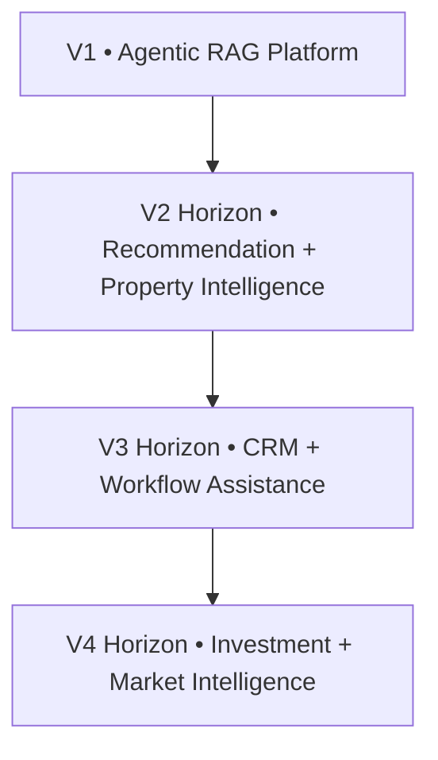

# Enterprise AI Platform for Real Estate — Project Vision

**Status:** PROPOSED REQUIREMENTS ALIGNMENT
**Version:** 2.0
**Last Updated:** 2026-08-18
**Initial Capability:** Agentic RAG
**Service Boundary:** Python AI Microservice

## 1. Purpose

This document defines the long-term product and engineering vision for the Python AI Platform that will serve the existing worldwide real estate platform.

It answers one primary question:

> What are we building, why are we building it, and what must remain true as the platform evolves?

This document intentionally does not define detailed module boundaries, dependency graphs, provider interfaces, API contracts, deployment topology, or LangGraph graph structure. Those decisions belong in `ARCHITECTURE.md` and the relevant Architecture Decision Records (ADRs).

`PROJECT_VISION.md` is the north star. Architecture, implementation, roadmap, code review, and AI-assisted development must remain consistent with it.

## 2. Context

The company already operates a worldwide real estate product with an existing Next.js backend, web application, and mobile application.

The Python project is not a replacement for those systems. It is a dedicated AI service that adds AI capabilities to the existing platform through explicit APIs consumed by the Next.js backend.

The immediate need is a production-grade Agentic Retrieval-Augmented Generation (RAG) capability. The longer-term opportunity is larger: establish a reusable AI platform capable of supporting multiple real estate intelligence and automation capabilities without rebuilding the foundation for every new AI feature.

## 3. Mission

Build a production-grade, secure, observable, extensible AI platform for real estate that can deliver grounded intelligence and agentic capabilities to the existing product through stable service boundaries.

The platform must be engineered as a durable product, not as a chatbot prototype, LangChain tutorial, or one-off RAG application.

## 4. Product Vision

The Python service will become the common AI execution platform for the real estate product.

Over time, the platform should be capable of supporting areas such as:

- document intelligence and grounded question answering;
- property search and discovery assistance;
- personalized property recommendations;
- real estate workflow assistance;
- CRM-related AI capabilities;
- scheduling and task-oriented assistance;
- real estate analytics and insight generation;
- investment-oriented analysis;
- image and multimodal search or analysis where justified;
- additional domain-specific agents and tools introduced through controlled platform interfaces.

These are capability directions, not commitments for Version 1. They exist to ensure the V1 foundation does not unnecessarily constrain the platform's future.

## 5. Version 1 Mission — Production-Grade Agentic RAG

Version 1 establishes Agentic RAG as the first production capability of the platform.

The goal is not merely to retrieve vector matches and send them to an LLM. V1 must establish the foundations required for a reliable AI service: retrieval, grounded generation, provider abstraction, prompt management, orchestration, API boundaries, error handling, configuration, testing, security, observability, streaming, and the operational controls required for production use.

LangGraph is used for agent orchestration only. Domain logic, retrieval logic, provider logic, prompt construction, validation, and other application behavior must remain independently testable and must not become inseparable from the orchestration framework.

V1 is successful when the existing Next.js backend can consume a stable Python AI API that provides dependable, traceable, grounded RAG behavior and creates a sound foundation for future real estate agents and tools.

## 5.1 Nofeez Knowledge and Truth Boundary

Version 1 must preserve four different kinds of information:

1. Stable canonical knowledge, answered through RAG.
2. Dynamic domain state, obtained from authoritative live services.
3. Estimates and predictions, produced by approved model services and labeled accordingly.
4. Transactional state changes, executed only through authorized tools.

The 110 approved Markdown modules are canonical Nofeez knowledge sources. They must be parsed by YAML metadata, semantically chunked, versioned, hashed, traced and indexed without silent source mutation.

A query router must select the source class before retrieval or tool execution. Permission filters apply before restricted context reaches the LLM. The platform must prefer UNKNOWN or CURRENT_STATE_UNAVAILABLE over unsupported claims.

## 6. System Boundary

The Python AI Platform owns AI-specific capabilities and exposes them through APIs.

The existing Next.js backend remains the primary application backend and integration boundary for the web and mobile applications. The Python service must not require redesigning or replacing the existing backend.

The intended interaction model is:

`Web / Mobile -> Existing Next.js Backend -> Python AI Platform`

This separation is a deliberate product boundary. AI implementation details must not leak into clients, and the Python service must not absorb unrelated responsibilities that belong to the existing product backend.

## 7. Engineering Quality Bar

The platform is expected to meet an enterprise production standard.

That means the project must be designed for:

- correctness and predictable behavior;
- explicit, typed contracts;
- clear dependency direction and separation of concerns;
- testability without requiring live production providers;
- secure configuration and secret handling;
- observable requests, failures, latency, and AI operations;
- controlled failure behavior and typed application errors;
- scalable provider and infrastructure boundaries;
- asynchronous I/O where appropriate;
- maintainability by engineers who did not author the original system;
- safe evolution without architectural drift.

"Production-grade" is not a label applied after implementation. It is a constraint on how the platform is designed, tested, reviewed, deployed, and operated from the beginning.

## 8. Core Platform Principles

### 8.1 AI Platform, Not a Single RAG Feature

Agentic RAG is the first capability, not the permanent boundary of the system. Shared infrastructure should be reusable where that reuse is natural and justified.

### 8.2 Stable Application Boundaries

FastAPI is the HTTP delivery layer, not the location for core business or AI logic. API routes should translate transport concerns into application calls and return stable contracts.

### 8.3 Provider Independence

Application logic must depend on platform-defined provider contracts rather than concrete vendor SDKs. Provider implementations may change without forcing the application layer to be rewritten.

Provider abstraction is a portability and testability mechanism, not permission to add speculative providers without a product need.

### 8.4 Orchestration Is Not Business Logic

LangGraph coordinates agent state and execution. It must not become a container for retrieval algorithms, prompt construction, provider-specific calls, session persistence, or real estate business rules.

### 8.5 Grounded AI by Default

RAG responses must be built around attributable retrieved evidence. The system should prefer an explicit insufficient-context outcome over unsupported confidence.

### 8.6 Testability Is Architectural

LLMs, embeddings, vector stores, and external services must be replaceable by test doubles at appropriate boundaries. Core workflows should be verifiable deterministically wherever practical.

### 8.7 Operational Visibility Is a Product Requirement

A production AI service must make failures diagnosable. Logging, metrics, tracing, request correlation, provider latency, retrieval behavior, and relevant AI usage signals are first-class platform concerns.

### 8.8 Security Is a Default Constraint

The service must use explicit trust boundaries, validated inputs, controlled configuration, safe error responses, appropriate authentication/authorization integration, and disciplined handling of documents and model context.

### 8.9 Architecture Must Be Explicit

Important architectural decisions are recorded in ADRs. Contributors—human or AI—must not silently introduce alternative architectural patterns, providers, frameworks, or cross-layer dependencies.

## 9. Development and Production Model

Development and production may use different infrastructure while preserving the same platform contracts.

The approved direction is:

| Concern | Development | Production |
| --- | --- | --- |
| Programming language/runtime | CPython 3.14.7 only | CPython 3.14.7 only |
| Framework | FastAPI + Pydantic | FastAPI + Pydantic |
| Agent framework | LangGraph — orchestration only | LangGraph — orchestration only |
| LLM Provider | Local Qwen 3.6 through LM Studio's OpenAI-compatible endpoint | AWS Bedrock models |
| Embedding Provider | Current development configuration | AWS Bedrock Embedding Models |
| Vector database | Qdrant | Qdrant |
| Deployment | Developer-controlled local environment | Independently deployable AI microservice; production platform decision is separate |
| Development tooling | Mac with VS Code/Cline + PC-hosted LM Studio | Not an architectural production dependency |

The local development environment currently includes Qwen 3.6 14B A3B FableVibes Q5/Q4 through LM Studio on an RTX 4070 Super / Ryzen 9700X / 32 GB RAM workstation. Development workflows should remain practical on this environment without weakening production abstractions.

Provider selection is configuration-driven. Exactly one implementation per provider capability is active at a time; V1 does not require multi-provider fan-out or routing. Production and development provider choices must not force vendor-specific logic into application services, and no currently approved vendor is permanently coupled to the architecture.

## 10. Version 1 Product Outcomes

V1 should leave the organization with more than a working `/query` endpoint. It should establish:

1. a stable AI service boundary for the existing Next.js backend;
2. a dependable canonical Markdown ingestion, validation, versioning and incremental-index foundation;
3. grounded response generation with source attribution and explicit stable/live/model/action routing;
4. provider contracts for LLM, embeddings, and vector storage;
5. Qdrant dense/sparse hybrid retrieval for both development and production behind the platform vector-store contract;
6. controlled prompt construction and prompt lifecycle practices;
7. LangGraph-based agent orchestration with application logic outside the graph;
8. session/memory behavior where required by the approved V1 architecture;
9. streaming behavior appropriate for application integration;
10. typed configuration, validation, errors, and API contracts;
11. meaningful automated tests across architectural boundaries;
12. security and observability foundations suitable for production operation;
13. permission-aware context assembly and isolation of public, developer/project and private namespaces;
14. reconciliation and conflict detection for documents, chunks and indexes;
15. engineering documentation that keeps future human and AI contributors aligned.

## 11. Explicit Non-Goals

Version 1 is not intended to:

- replace or redesign the existing Next.js backend;
- rebuild the existing web or mobile applications;
- implement every future AI capability described in this vision;
- become a general-purpose autonomous agent framework;
- place business logic directly inside FastAPI route handlers;
- place application logic directly inside LangGraph nodes merely for convenience;
- couple the platform to a single development LLM or vector database;
- add providers, abstractions, services, or infrastructure solely for hypothetical future use;
- treat successful local demos as evidence of production readiness.

## 12. AI-Assisted Engineering Philosophy

AI-assisted coding is part of the development workflow, including Cline with a local Qwen model. AI assistance must increase delivery speed without becoming an uncontrolled architecture author.

The repository's engineering documents are therefore executable governance for contributors.

Before making material code changes, AI-assisted implementation prompts should reference the relevant project vision, architecture rules, coding standards, contribution rules, ADRs, and task acceptance criteria.

AI contributors must not independently redesign the architecture, replace approved technologies, broaden task scope, or introduce new framework patterns without an explicit architectural decision.

Every implementation task should be narrow enough to review and should have explicit allowed scope, constraints, acceptance criteria, and a completion checklist.

## 13. Definition of Long-Term Success

The platform succeeds long term when new real estate AI capabilities can be introduced through understood, tested extension points instead of repeatedly creating isolated AI applications.

Success means:

- the existing product can consume AI capabilities through stable APIs;
- development providers can change without changing business behavior;
- production infrastructure can scale without rewriting the application core;
- agent orchestration can evolve without absorbing business logic;
- AI responses are grounded, observable, and operationally diagnosable;
- security and privacy controls evolve with capability risk;
- engineers can understand why the system is structured as it is;
- architectural decisions remain discoverable through documentation and ADRs;
- local AI-assisted development remains productive while production quality remains the standard.

## 14. Decision Filter

When evaluating future architecture or implementation choices, ask:

1. Does this strengthen the Python AI Platform rather than solve only a demo scenario?
2. Does it preserve the service boundary with the existing Next.js backend?
3. Does it keep business logic independent of FastAPI, LangGraph, and concrete providers?
4. Is the choice necessary for an approved requirement, or is it speculative complexity?
5. Can it be tested without depending exclusively on live external services?
6. Can it be operated securely and observed in production?
7. Does it preserve a practical local-development path?
8. Is the decision consistent with existing ADRs and architecture rules?

If a proposed change conflicts with this vision, the conflict must be made explicit and resolved as an architectural decision before implementation proceeds.

## 15. Relationship to Other Engineering Documents

This document defines **why and what**.

- `ARCHITECTURE.md` defines **how the platform is structured**.
- ADRs define **why significant technical decisions were made**.
- `CODE_STYLE.md` defines **how code is written consistently**.
- `CONTRIBUTING.md` defines **how human and AI contributors change the system safely**.
- `API_GUIDELINES.md` defines **API contract conventions**.
- `TESTING.md` defines **verification standards**.
- `SECURITY.md` defines **security requirements and trust boundaries**.
- `OBSERVABILITY.md` defines **logging, metrics, tracing, and diagnostic expectations**.
- `ROADMAP.md` defines **planned capability evolution**.
- `TASKS.md` defines **the current execution focus**.
- `PROMPTS.md` records **controlled AI-assisted implementation prompts**.
- `REVIEW.md` records **engineering review history and follow-up**.

Together, these documents form the engineering operating system for the Python AI Platform.

## 16. Principles That Must Never Change

These principles form the project's engineering constitution. They are intentionally repeated at the vision level because losing them would change the character of the platform, not merely an implementation detail.

1. **Thin Controllers** — FastAPI controllers translate transport concerns and invoke application use cases; they do not implement AI/business workflows.
2. **Provider Pattern** — application behavior depends on platform-defined contracts, never concrete AI/vector provider SDKs.
3. **Prompt Builder Owns Prompts** — prompts and model-request construction do not belong in providers, controllers, or graph nodes.
4. **Retriever Owns Retrieval** — retrieval policy, context selection, filtering semantics, and reranking coordination belong to the retrieval layer.
5. **LangGraph Owns Orchestration** — LangGraph coordinates application capabilities; it does not become the home of business logic.
6. **Async-First I/O** — network/storage/model I/O is designed for correct asynchronous execution and cancellation where supported.
7. **No Business Logic in Providers** — providers adapt external systems to platform contracts; they do not make product decisions.
8. **No Business Logic in FastAPI** — the HTTP framework is a delivery mechanism, not the application architecture.
9. **Explicit Dependency Injection** — dependencies are composed at controlled boundaries rather than hidden behind uncontrolled globals/service location.
10. **No Circular Dependencies** — architectural layers have explicit dependency direction and cycles are treated as design defects.
11. **Typed Boundaries** — public module/provider/application contracts use explicit types and application-owned models.
12. **Architecture Changes Are Deliberate** — neither human nor AI contributors silently introduce new architectural patterns, frameworks, providers, or cross-layer shortcuts.

These principles may be refined as the platform matures, but changing their meaning requires explicit architecture review and, when material, an ADR.

## 17. Engineering Success Metrics

These are engineering quality measures, not business KPIs. They are used to determine whether the platform is becoming safer, more reliable, and easier to evolve.

| Measure | Desired Direction / Release Criterion |
| --- | --- |
| Groundedness | Provisional target of at least 95% on the approved RAG evaluation set; ratified only after a trustworthy baseline exists |
| Citation correctness | Material claims that require grounding map to supporting retrieved evidence; numeric release threshold defined in `TESTING.md` after baseline evaluation |
| P95 latency | Meets the validated component and streaming performance budgets defined in `ARCHITECTURE.md`/observability standards |
| Time to first streamed token/event | Meets the validated production streaming budget; tracked separately from total generation duration |
| Automated verification | Every critical provider/application contract and production use-case path has meaningful automated coverage; numeric coverage gates are defined by `TESTING.md`, not vanity percentages |
| Provider leakage | Zero concrete provider SDK usage in controllers/application business logic |
| Circular dependencies | Zero known architectural dependency cycles |
| Architecture review | Zero unresolved architecture-blocking findings at release; subjective numeric architecture scores are diagnostic, not release proof |
| Typed error boundaries | External provider failures are translated before reaching application/API consumers |
| Production diagnostics | Every production request can be correlated across application stages without requiring sensitive prompt/document logging |

The goal is not to optimize a dashboard. The goal is to make architectural erosion, AI-quality regression, latency regression, and provider coupling visible before they become production problems.

## 18. Future Vision Timeline

The following is a capability horizon, not a contractual release schedule. `ROADMAP.md` owns actual sequencing and may promote, split, or reorder capabilities as product requirements evolve.

Across those horizons, reusable capabilities such as document intelligence, property search, image search, scheduling, analytics, tool calling, and memory may be introduced when their product requirements are approved.

The important promise is architectural rather than chronological: future capabilities should extend the platform through controlled application, tool, repository, and provider boundaries instead of forcing a fundamental rewrite.

## 19. Engineering Culture

We optimize for long-term maintainability over short-term convenience.

That means:

- we prefer clear ownership over clever abstractions;
- we prefer explicit contracts over hidden coupling;
- we preserve working code when it fits the architecture and refactor only for a concrete reason;
- we do not confuse speed of code generation with speed of engineering delivery;
- we write tests and documentation as part of the implementation, not as cleanup work;
- we surface uncertainty, tradeoffs, and technical debt instead of hiding them behind optimistic status reports;
- we make small, reviewable changes rather than asking AI tools to generate or rewrite the entire platform at once;
- we record important decisions so future engineers understand why the system evolved as it did;
- we measure production readiness through evidence—tests, evaluations, security, observability, and operational behavior—not through successful demos;
- we expect architecture rules to apply equally to human-written and AI-generated code.

The standard is simple: a decision that saves minutes today but creates ambiguity, coupling, or operational risk for every future contributor is usually the wrong trade.

## 20. Vision Statement

> Build an enterprise-grade AI platform for real estate whose first production capability is Agentic RAG, whose architecture remains independent of individual model and infrastructure providers, and whose APIs allow the existing real estate product to adopt increasingly capable AI features without sacrificing reliability, security, observability, or maintainability.
